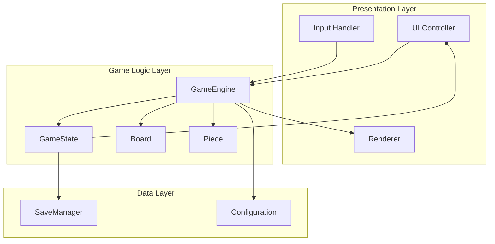
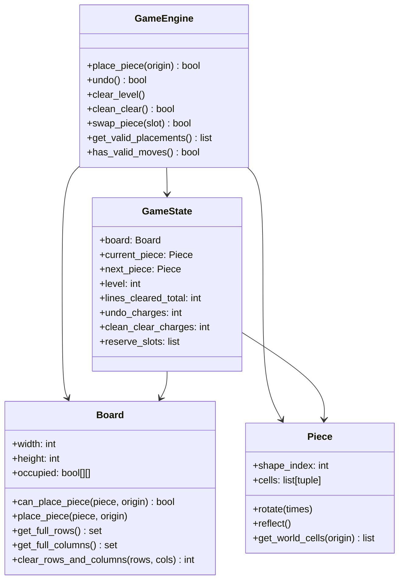
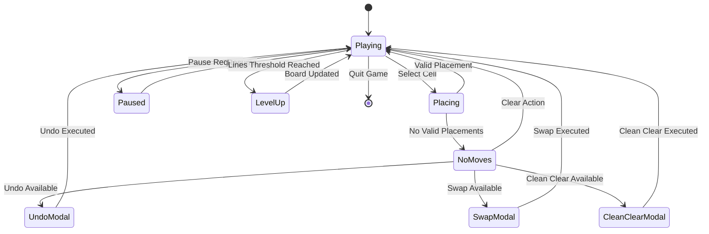
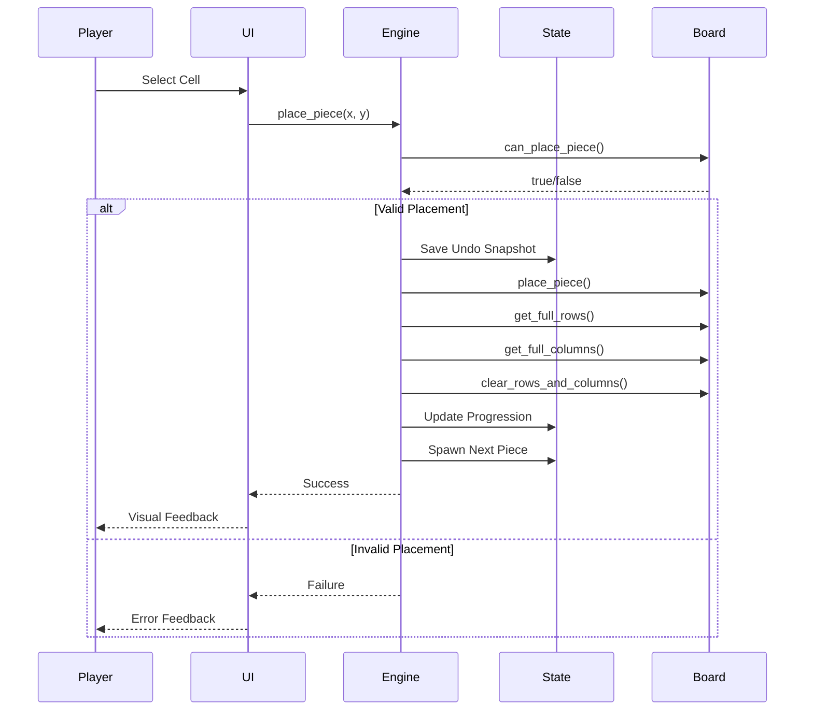

# Urban Ivy - Architecture Documentation

## System Architecture



## Core Entity Relationships



## Game Flow State Machine



## Data Flow During Turn



## API Boundaries

### Game Logic → Presentation Interface
```python
# Core API methods
place_piece(origin: Tuple[int, int]) -> bool
undo() -> bool
clear_level() -> void
clean_clear() -> bool
swap_piece(slot_index: int) -> bool
get_valid_placements() -> List[Tuple[int, int]]
has_valid_moves() -> bool

# State queries
get_board_state() -> Board
get_current_piece() -> Piece
get_game_stats() -> GameStats
```

### Presentation → Game Logic Interface
```python
# Input actions
on_cell_selected(x: int, y: int)
on_undo_requested()
on_clear_requested()
on_clean_clear_requested()
on_swap_requested(slot_index: int)
on_pause_requested()
```

## Component Responsibilities

### GameEngine
- Enforces all game rules
- Manages state transitions
- Handles piece placement and validation
- Coordinates line clearing and progression
- Manages undo/redo functionality

### GameState
- Stores complete game state
- Tracks progression metrics
- Manages power-up charges
- Maintains piece statistics

### Board
- Manages grid occupancy
- Handles piece collision detection
- Tracks full rows/columns
- Manages board resizing

### Piece
- Defines piece shapes and transformations
- Handles rotation and reflection
- Calculates world positions
- Manages piece library

## Separation of Concerns

- **Game Logic**: Pure rules and state management (no rendering)
- **Presentation**: UI, input handling, visual feedback
- **Persistence**: Save/load functionality
- **Configuration**: Difficulty settings, piece weights

This architecture ensures the game logic is completely independent of any rendering framework, making it portable across different platforms and implementations.
